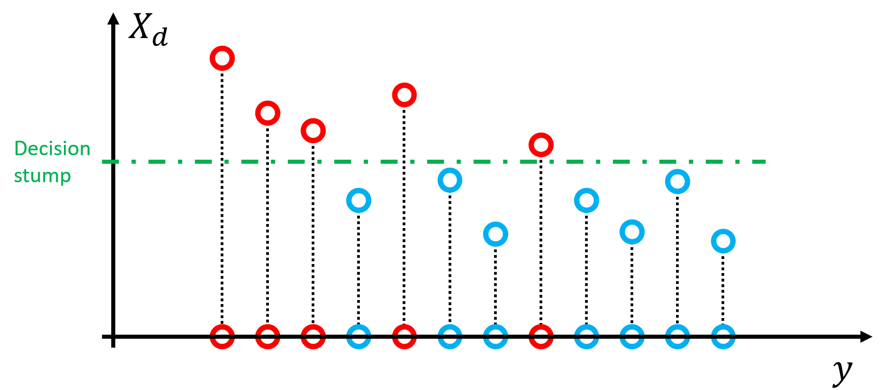

Non-parametric Regression Tree
---

All objective functions based on absolute value (square, absolute, Huber... ) have implicit parametric distribution assumption in disguise (Gaussian, Laplace...), thus fail badly when assumption not satisfied.

To have a robust (outliers-free) regression tree, we should use objective function only depends on ***relative value***.

Background
---

Let's say we have a decision stump on the *dth* dimension that splits data points into reds(xi=1) and blues(xi=0).

To find the ***best split***, first define a objective function depends only on relative values of data points.

### Non-parametric approach

[Kendall's Tau](https://en.wikipedia.org/wiki/Kendall_rank_correlation_coefficient), also known as ***bubble sort distance***. Defined as follow: 

}\sum_{i%3Cj}sgn(x_i-x_j)sgn(y_i-y_j))

When i, j have same color, ) goes to zero, thus it's equivalent to:

}\sum_{i\in%20Red;j\in%20Blue}sgn(y_i-y_j))

}\frac{1}{|Red||Blue|}\[N(red%3Eblue)-N(blue%3Ered)\])

\times\[P(red%3Eblue)-P(blue%3Ered)\])

)

There is a trade-off between balance & difference.

In practice, we can use other impurities (entropy...) & differences (log odds...) as long as 
=-diff(blue,red)).

**Note that:**

=\frac{n-1}{n}%202P_{Red}P_{Blue}\simeq%201-(P_{Red}^2+P_{Blue}^2))

*([Gini impurity](https://en.wikipedia.org/wiki/Decision_tree_learning#Gini_impurity))*

+P(red=blue)+P(red<blue)=1)

*(conditional probability, draw one blue & one red without replacement)*

Problem Statement
---

,Y))

where 
is ***kendall rank correlation coefficient*** shown before.

and =I(x_i>s))

### Compare with SSE

,Y))

where *r* is ***pearson correlation coefficient***.

Algorithm
---

Calculate following for every possible stump,

)

1. Initialize:

    Set all points to blue , `tau` = 0, `maximum` = 0  
    Sort samples by *`Xd`* as a queue

2. get next item `i` from queue, turn it red. 
3. Calculate tau, record stump if |`tau`| > `maximum`

    }-\sum_{r\in%20Red}{sgn(y_r-y_i)})

    )

4. repeat **2.** until all points are red

In short:

\big))

### Dynamic Programing

With precompute:

+ \,%20A_{ij}=sgn(y_i-y_j))

+ sort every dimension

Time complexity )

Then for every depth:

+ calculate cummulate sum for each leaf

Time complexity )

Further
---

Just like what elastic net does, we can consider both abosulte & relative value by weighted sum.

Ex: Objective function = \tau^2)
